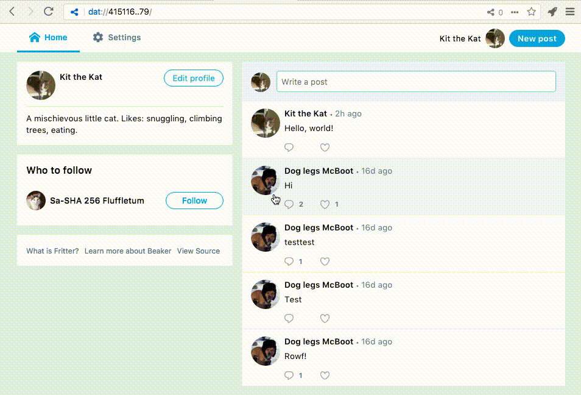

# Fritter

An example application that demonstrates how to build peer-to-peer Web applications with [Beaker Browser](https://github.com/beakerbrowser/beaker), [Dat](https://github.com/datproject/dat), and [WebDB](https://github.com/beakerbrowser/webdb).



## Features

Fritter is a simple social feed application; it implements:

- Writing posts
- Replying to posts
- Favoriting posts and replies
- Following users
- Editing your profile

Fritter uses [libfritter](https://github.com/beakerbrowser/libfritter) to manage its data definitions and methods. Check it out to see a well-documented example of using [WebDB](https://github.com/beakerbrowser/webdb).

## What is a peer-to-peer Web app?

The peer-to-peer (p2p) Web is a loose term for describing the community of websites and applications that are built on top of p2p protocols like [`dat://`](https://github.com/datproject/dat).

A p2p Web app is like any other website or app: it's a collection of HTML, CSS, JavaScript, and other files. What makes it different? It uses a p2p protocol (in this case `dat://`) instead of [HTTP](https://en.wikipedia.org/wiki/Hypertext_Transfer_Protocol).  Most p2p websites and apps are not supported in mainstream browsers like Firefox or Chrome, but you can use [Beaker](https://beakerbrowser.com) to access websites that use the `dat://` protocol.

## How Fritter works

### User profiles

User profiles on the p2p Web are a bit different than user profiles on the traditional Web. Instead of being stored in a server-side database, they're simply websites! This means you can look at all the files that comprise a profile. Check out Dog Legs McBoots's profile to see for yourself:

```
dat://232ac2ce8ad4ed80bd1b6de4cbea7d7b0cad1441fa62312c57a6088394717e41
```

`profile.json` contains some basic information about the profile:

```
{
  "name": "Dog legs McBoot",
  "bio": "A good boy",
  "avatar": "avatar.png",
  "follows": []
}
```

Posts are stored as individual files in the `/posts` directory. Each file is addressed by its [base36-encoded timestamp](https://github.com/beakerbrowser/libfritter/blob/70cabb5af5d0baf78a7c85cd33f366d9ef41ae23/lib/feed.js#L16). Votes/likes/favorites are recorded in the `/votes` directory using the same technique.


```
/posts
|-- 0jbdviucy.json
|-- 0jbdvkv1r.json
|-- 0jbdvsjo9.json
```

A post includes the content of the post, a timestamp, and if applicable, information about the post it's in reply to:

```
{
  "text": "hi",
  "threadRoot": "dat://232ac2ce8ad4ed80bd1b6de4cbea7d7b0cad1441fa62312c57a6088394717e41/posts/0jbdvsjo9.json",
  "threadParent": "dat://232ac2ce8ad4ed80bd1b6de4cbea7d7b0cad1441fa62312c57a6088394717e41/posts/0jbdvsjo9.json",
  "createdAt":1513703188329
}
```

### Storing user profiles

Fritter uses [Beaker's DatArchive APIs](https://beakerbrowser.com/docs/apis/dat.html) to access the Dat network. This makes it possible to store profiles locally on the user's computer, and to transfer profile information directly between user devices.

Fritter keeps track of the URL for the user's profile with Local Storage under the key `userUrl`. In a more robust implementation of an app like Fritter, users could switch between their profiles by being prompted to select a profile using Beaker's [`DatArchive.selectArchive()`](https://beakerbrowser.com/docs/apis/dat.html#datarchive-selectarchive) method, and then updating the value of `localStorage.userUrl`.

## Getting started

### Try Fritter

Visit Fritter in [Beaker](https://beakerbrowser.com/docs/install/) to create your own profile:

```
dat://9900f9aad4d6e79e0beb1c46333852b99829e4dfcdfa9b690eeeab3c367c1b9a
```

 Keep in mind that Fritter is an example application and is missing some features like notifications and search that would make it a viable social media application.

### Customizing Fritter

On the p2p Web, user profiles are simply websites that are formatted so they can be used by many different applications. This makes it possible to customize websites and apps without needing to create a new profile!

For example, to use a custom theme on Fritter, you could [fork](https://beakerbrowser.com/2017/06/14/forking-websites-on-the-p2p-web.html) Fritter using Beaker, then update Fritter's CSS as much or as little as you'd like. Alternatively, you can clone this repository, implement your changes, then deploy your custom version of Fritter onto the Dat network using Beaker or the [Dat CLI](https://github.com/datproject/dat).

## Questions or concerns?

- Talk to us on Twitter: [@BeakerBrowser](https://twitter.com/beakerbrowser)
- Chat on IRC: [#beakerbrowser](https://webchat.freenode.net/?channels=beakerbrowser)
- [File an issue](https://github.com/beakerbrowser/fritter/issues)
